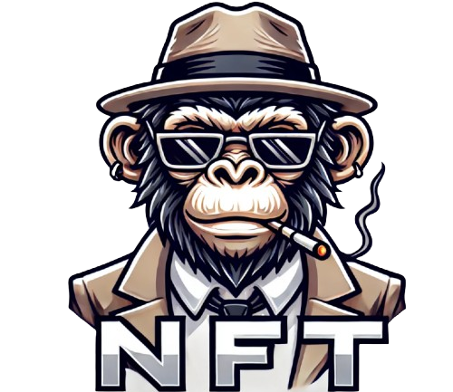

# NFT Marketplace Application

## 🎨 Project Description

**NFT Marketplace** is a decentralized web application that allows users to buy, sell, and auction their ERC721 NFTs on the blockchain. Built using modern technologies such as **React**, **Redux Toolkit**, and **Chakra UI**, this platform provides users with the ability to seamlessly manage their NFTs, participate in auctions, and make secure transactions via **smart contracts** on the **Sepolia Test Network**. 

The application is powered by **Alchemy API** to fetch wallet-based NFTs and utilizes **ethers.js** for interacting with blockchain smart contracts. This platform supports **ERC721** NFTs, allowing users to trade and auction their digital assets in a smooth and decentralized manner.

🔗 **Live Demo:** [Access NFT Marketplace Here](https://nftmarketcanozgen.netlify.app/)

---

## 🖼️ Application Screenshots

### **Home Page**
The home page provides users with essential information about the marketplace and serves as a gateway to other sections of the application. Users can easily navigate to view NFTs for sale, participate in auctions, or manage their own NFT collections.

---

### **My NFTs Page**
The **My NFTs** page allows users to manage their NFT collections directly from their connected wallet. Users can view their **unlisted NFTs**, **NFTs listed for sale**, and **NFTs currently in auction**. Each NFT can be listed for sale or put up for auction directly from this page. If an NFT is already on sale or auction, the user can cancel the listing under the appropriate conditions. The page also includes pagination for ease of use when handling larger collections.

Key features of the **My NFTs** page include:
- **View Unlisted NFTs**: See all your NFTs that are not currently listed for sale or auction.
- **List for Sale**: Set a price and quantity to list NFTs for sale.
- **Start Auction**: Create an auction by setting a start price, start time, and end time.
- **Cancel Sale or Auction**: If needed, cancel ongoing sales or auctions.
- **Pagination**: Easy navigation through large collections.

Below are some screenshots of the **My NFTs** page showing different states:

---

### **NFT Auction Page**
A page where users can view NFTs in auction. Users can place bids on NFTs, cancel their own auctions, or claim their NFTs if they have won the auction.

---

### **NFT Listing Page**
This page displays all available NFTs for sale. Users can sort by price and filter through categories to find their desired NFTs.

---

## 🛠️ Technologies Used

### **Frontend:**
- **React**: Core framework for building the user interface.
- **Chakra UI**: Modern UI components for a responsive and elegant design.
- **Redux Toolkit**: For managing the global state of the application.
- **React Router DOM**: For handling navigation between different views.
- **React Toastify**: For user notifications and feedback on transactions.
- **Slick Carousel**: To showcase NFT collections with a smooth scrolling effect.
- **Responsive Design**: Ensuring adaptability across different devices using Chakra UI's responsive utilities.

### **Backend:**
- **Ethers.js**: For interacting with Ethereum smart contracts.
- **Alchemy API**: To fetch and manage NFT data from users' wallets.
- **GraphQL**: For querying NFT and auction data efficiently.
- **MetaMask**: Secure wallet connection for blockchain interactions.
- **Node.js**: Backend environment for managing API requests and transaction processes.

